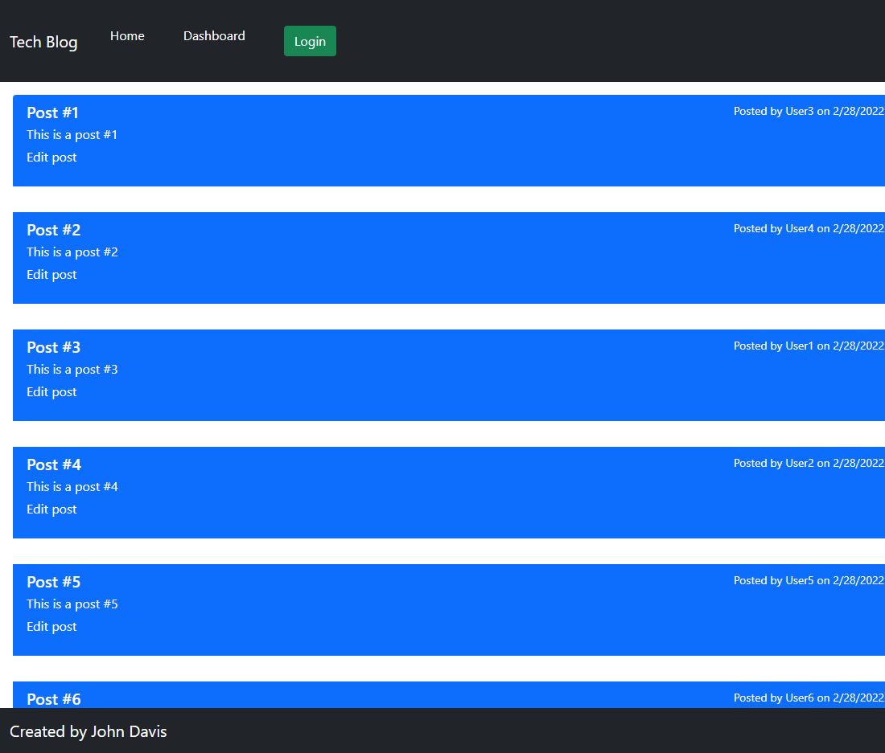
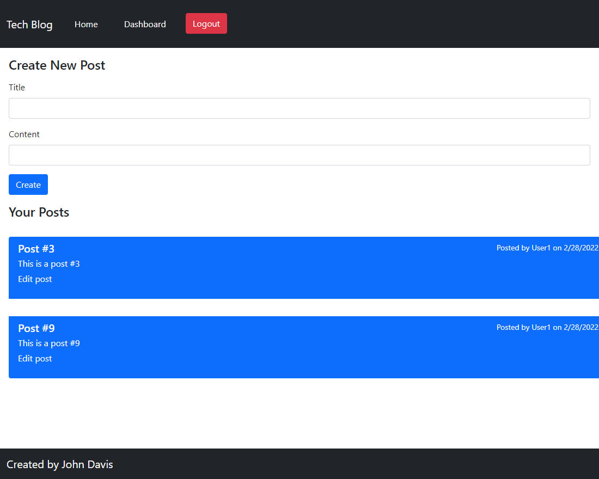
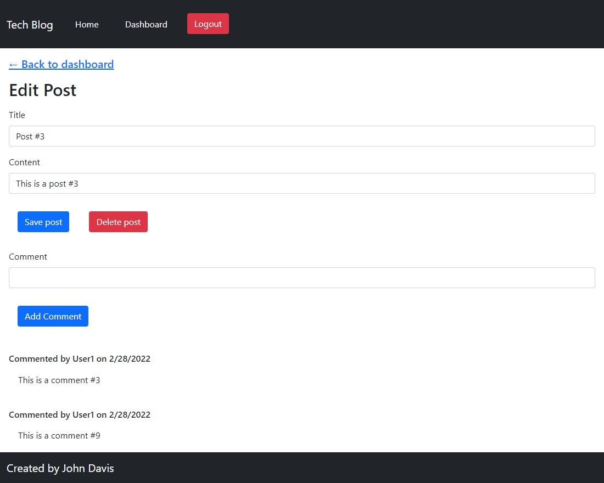
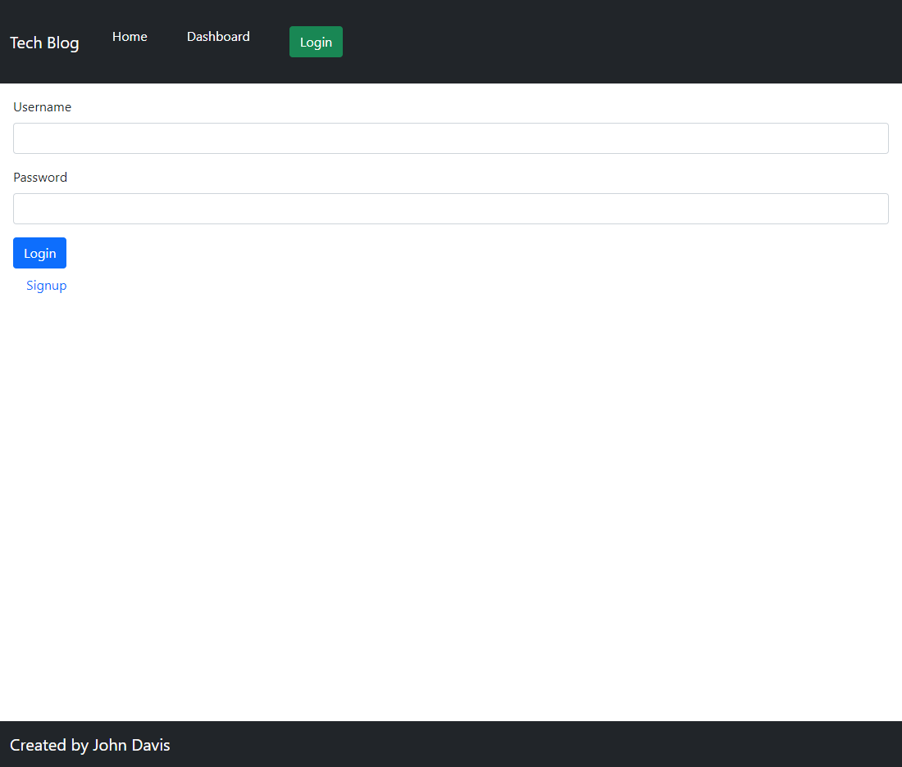
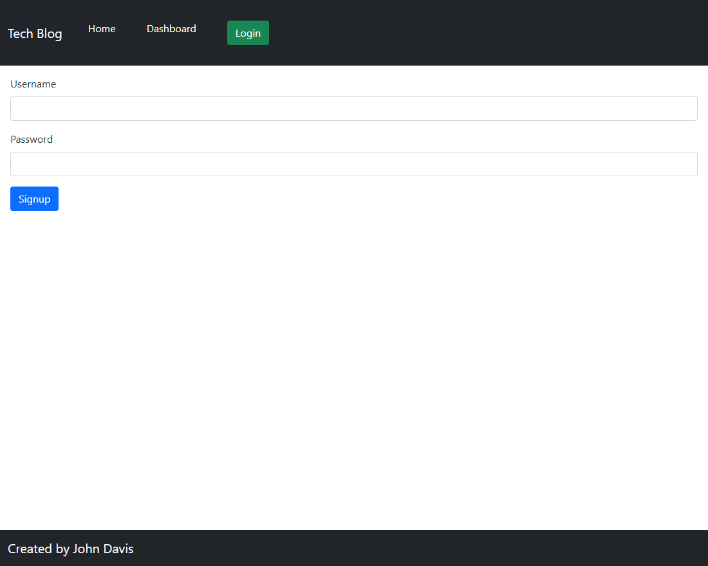

  # Salty Brook

  

  ### Description 

  I learned a few things on this challenge. I leanred how to use boilerplates from the module work to make the proccess go much faster. I learned that I can build many different projects with a few generic groups of code to build a backbone then go from there. 

  ## Table of Contents

  * [Installation](#installation)
  * [Usage](#usage)
  * [Credits](#credits)
  * [License](#license)
  * [Questions](#questions)

  ### Installation

  [Heroku Deployed Link](https://tech-blog-92790.herokuapp.com/)

  ### Usage 

  This can be a good starting point to create a blog of many kinds.

  See the following images for a preview!
  
  
  
  
  

  ### Credits
  
  Module 14 coursework and help from our awesome TA's! I used a lot of code from the module work. Most of it was pretty generic, then changed it around for my needs.

  ### License

  

  Permission is hereby granted, free of charge, to any person obtaining a copy of this software and associated documentation files (the "Software"), to deal in the Software without restriction, including without limitation the rights to use, copy, modify, merge, publish, distribute, sublicense, and/or sell copies of the Software, and to permit persons to whom the Software is furnished to do so, subject to the following conditions:

  The above copyright notice and this permission notice shall be included in all copies or substantial portions of the Software.

  THE SOFTWARE IS PROVIDED "AS IS", WITHOUT WARRANTY OF ANY KIND, EXPRESS OR IMPLIED, INCLUDING BUT NOT LIMITED TO THE WARRANTIES OF MERCHANTABILITY, FITNESS FOR A PARTICULAR PURPOSE AND NONINFRINGEMENT. IN NO EVENT SHALL THE AUTHORS OR COPYRIGHT HOLDERS BE LIABLE FOR ANY CLAIM, DAMAGES OR OTHER LIABILITY, WHETHER IN AN ACTION OF CONTRACT, TORT OR OTHERWISE, ARISING FROM, OUT OF OR IN CONNECTION WITH THE SOFTWARE OR THE USE OR OTHER DEALINGS IN THE SOFTWARE.

  ### Questions?

  [John Davis GitHub Account](https://github.com/johndavis92790/)
  [John Davis Email](mailto:johndavis92790@gmail.com)